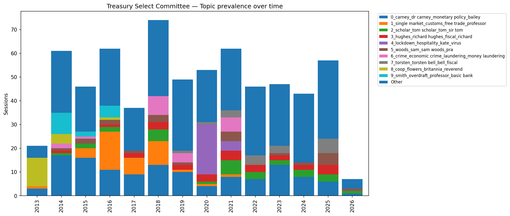

# Treasury Select Committee -- Topic Modelling

NLP topic modelling over 13 years of UK Treasury Select Committee oral evidence transcripts (2013--2026), using BERTopic.

**675 sessions | 13 million words | 33 discovered topics**

Built by [@AscendedYield](https://x.com/AscendedYield)

---

## What this does

1. **Extracts** every oral evidence transcript from the [UK Parliament Committees API](https://committees-api.parliament.uk/index.html) (no authentication required)
2. **Decodes** base64-encoded HTML transcripts to plain text
3. **Runs BERTopic** (sentence-transformers + UMAP + HDBSCAN + c-TF-IDF) to discover latent topics
4. **Produces** per-session topic assignments, a topic dictionary, and a timeline chart

## Topic prevalence over time



## Discovered topics

| Topic | Sessions | Theme | Top keywords |
|------:|---------:|-------|-------------|
| 0 | 126 | Monetary policy | carney, monetary policy, bailey, financial stability, mpc |
| 1 | 41 | Brexit / EU trade | single market, customs, free trade, wto, border |
| 2 | 29 | HM Treasury operations | tom scholar, john glen, james bowler |
| 3 | 27 | OBR / fiscal forecasting | richard hughes, fiscal, andy king, obr, chote |
| 4 | 25 | Covid economic impact | lockdown, hospitality, furlough, virus |
| 5 | 22 | Prudential regulation | sam woods, pra, prudential, solvency ii |
| 6 | 21 | Economic crime | economic crime, money laundering, law enforcement, companies house |
| 7 | 18 | Fiscal events / Budget scrutiny | torsten bell, paul johnson, poverty, obr |
| 8 | 17 | Co-op Bank / Project Verde | coop, flowers, britannia, reverend flowers |
| 9 | 16 | Retail banking / access | overdraft, basic bank, cma, tomlinson |
| 10 | 16 | FCA leadership | nikhil rathi, consumer duty, ashley alder |
| 11 | 16 | HMRC | jim harra, lin homer, customs, avoidance |
| 12 | 15 | Green finance / net zero | national wealth fund, net zero, carbon, climate change |
| 13 | 15 | Tax policy | vat, reliefs, tax, troup |
| 14 | 14 | AI / venture capital / RBS GRG | ai, venture capital, ross mcewan, grg |
| 15 | 14 | Chancellor scrutiny | sunak, rachel reeves, spending review, darren jones |
| 19 | 11 | Gender / diversity in finance | gender, pay gap, diversity, women finance |
| 22 | 10 | Russia sanctions | sanctions, russia, ukraine, oil, ofsi |
| 32 | 5 | Crypto | crypto, blockchain, bitcoin, stablecoin |

Full topic dictionary: [topic_labels.csv](topic_labels.csv)

## Data source

All data comes from the **UK Parliament Committees API**:

```
GET https://committees-api.parliament.uk/api/OralEvidence?CommitteeId=158
GET https://committees-api.parliament.uk/api/OralEvidence/{id}/Document/Html
```

- Committee ID **158** = Treasury Select Committee
- Transcripts are returned as base64-encoded HTML
- No API key required
- 675 out of 694 sessions have downloadable transcripts (15 pre-2013 sessions lack documents)

## How to run

### 1. Install dependencies

```bash
pip install bertopic sentence-transformers pandas matplotlib requests
```

### 2. Extract transcripts

```bash
python tsc_extract.py
```

Downloads all oral evidence transcripts to `tsc_data/transcripts/` with a metadata CSV. Takes ~10 minutes on first run. Subsequent runs skip already-downloaded files.

### 3. Run topic modelling

```bash
python tsc_topics.py
```

Fits BERTopic on the full corpus and outputs:

| Output | Description |
|--------|-------------|
| `tsc_data/topics_by_session.csv` | Per-session topic assignments (665 rows) |
| `tsc_data/topic_labels.csv` | Topic dictionary with top keywords (33 topics) |
| `tsc_data/topics_over_time.png` | Stacked bar chart of topic prevalence by year |

## Repo structure

```
tsc_extract.py          # Parliament API transcript downloader
tsc_topics.py           # BERTopic topic modelling pipeline
topic_labels.csv        # Output: topic id -> keywords
topics_by_session.csv   # Output: per-session topic assignments
topics_over_time.png    # Output: timeline chart
```

## Notes

- The embedding model is `all-MiniLM-L6-v2` (default for BERTopic) -- runs on CPU
- Transcripts are long (~100k chars each), so BERTopic embeds the full text and uses c-TF-IDF with English stopword removal for topic representation
- Topic 0 (monetary policy) is the dominant topic across all years, reflecting the committee's core BoE scrutiny role
- Brexit (Topic 1) appears heavily in 2016--2019, Covid (Topic 4) in 2020--2021
- The `tsc_data/transcripts/` directory (~65M chars of text) is gitignored -- regenerate it with `tsc_extract.py`

## License

MIT
